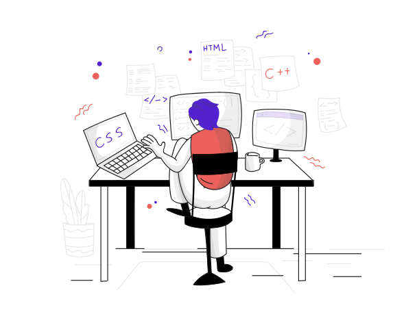

# Updesh Pr Singh

  

- 👋 Hi, I’m Updesh Pratap singh
- 👀 I’m interested in creating games, software and website
- 🌱 I’m currently learning Btech
- 💞️ I any looking to collaborate with me ...
- 📫 updesh071@gmail.com,updesh2020cs126@abesit.edu.in
## 🚀 About Me

I'm a Web developer...

  

  <a herf="#">

## Language & Framework

## 💻 My workspace
  
  
  
  
  

## Experience of Operating System

## Software

## 🔗 Links

## HacktoberFest 2K22

## Trophies 🏆
 

 

